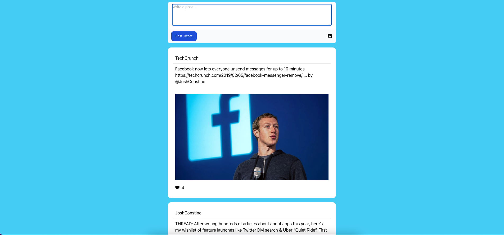
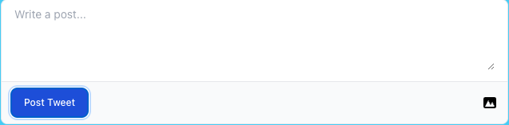
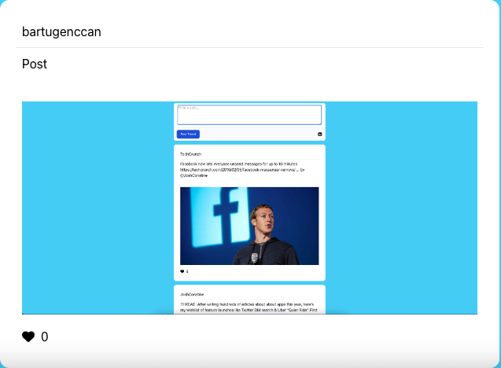

<h1 align="center">
  Social Media App with Redux Toolkit & Tailwind
</h1>

  This is a Social Media App for me to practice Redux Toolkit and Tailwind.

  
  The App Contains
  
  ***1-Feed***
  ***2-Adding Post***
  ***3-Post***
  
 

   

# Feed
The Home Page Feed
    

   

# Add Post
The Add Post Components
  
 

   

# Post
The Whole Post that user entered.
  
 

   

